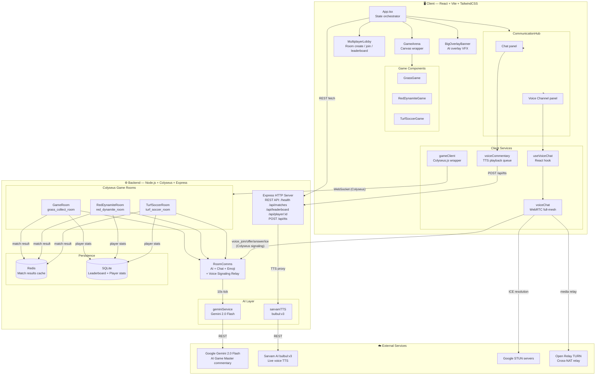

# 🎮 CHAOS ARENA

> A real-time multiplayer browser game platform powered by an AI Game Master — with live voice commentary, cross-device WebRTC voice chat, and a global leaderboard.

---

## Table of Contents

- [Overview](#overview)
- [Game Modes](#game-modes)
- [Architecture](#architecture)
- [Tech Stack](#tech-stack)
- [Project Structure](#project-structure)
- [Getting Started](#getting-started)
- [Environment Variables](#environment-variables)
- [REST API](#rest-api)
- [WebSocket Messages](#websocket-messages)

---

## Overview

Chaos Arena is a hackathon-built real-time multiplayer game platform where 2–8 players compete across three arcade-style mini-games. An **AI Game Master** (powered by Google Gemini) watches the action and constantly meddles — spawning hazards, changing physics, spotlighting players, and narrating the chaos via **Sarvam AI live voice commentary** (bilingual EN/HI, dual-host alternation). Players can also talk to each other via **WebRTC peer-to-peer voice chat** relayed through the game server.

---

## Game Modes

### 🌿 Grass Collect
A 60-second collection sprint. Players race to mow glowing grass tiles across an 800×600 arena with momentum-based physics. The AI Game Master periodically triggers arena events (boundary shrink, speed-up, slow-mo, spotlight) to shake up the leaderboard. Highest score at zero seconds wins.

### 🧨 Hot Dynamite
An elimination brawl where a ticking dynamite is forcefully attached to a random player. Move into another player to pass it before it explodes — eliminating the holder instantly. The timer accelerates as players drop. The AI may grease the floor (drift), spawn decoy bombs, or manipulate movement. Last stickman alive wins.

### ⚽ Turf Soccer
A chaotic 2-team soccer match. Players battle for ball control and goals in a physics-driven pitch. The AI shifts momentum, spotlights key players, and creates dramatic moments. First team to the point threshold wins.

---

## Architecture



### How It Fits Together

| Layer | Responsibility |
|---|---|
| **Colyseus Rooms** | Authoritative game state, physics tick, match lifecycle |
| **RoomComms** | Shared service injected into every room — handles chat, emoji, voice signaling relay, AI ticks |
| **geminiService** | Calls Gemini 2.0 Flash every 10 s; returns commentary + arena event + overlay + emoji burst |
| **sarvamTTS** | Backend proxy for Sarvam `bulbul:v3` TTS; keeps API key server-side |
| **voiceChat** | Full WebRTC mesh — one `RTCPeerConnection` per peer pair; Colyseus is the signaling channel |
| **voiceCommentary** | Client-side playback queue; decodes base64 WAV → Web Audio API; dual-host alternation |
| **SQLite** | Persistent player stats and match history |
| **Redis** | Fast match result caching (recent matches endpoint) |

---

## Tech Stack

### Backend
| Package | Purpose |
|---|---|
| `colyseus` + `@colyseus/ws-transport` | Real-time multiplayer server |
| `express` | REST API |
| `better-sqlite3` | Leaderboard & player stats persistence |
| `ioredis` | Match result caching |
| `dotenv` | Environment config |

### Client
| Package | Purpose |
|---|---|
| `react` 19 + `vite` | UI framework + bundler |
| `colyseus.js` | WebSocket game client |
| `tailwindcss` | Utility CSS |
| `motion` (Framer Motion) | Animations |
| `lucide-react` | Icons |
| Web Audio API | TTS playback decoding |
| WebRTC (browser native) | Peer-to-peer voice chat |

### AI / External
| Service | Usage |
|---|---|
| Google Gemini 2.0 Flash | AI Game Master commentary + arena events |
| Sarvam AI `bulbul:v3` | Live bilingual voice commentary (EN/HI, 4 speakers) |
| Google STUN (`stun.l.google.com`) | WebRTC ICE candidate resolution |
| Open Relay TURN (`openrelay.metered.ca`) | Cross-NAT WebRTC media relay |

---

## Project Structure

```
devhack-entropy/
├── backend/
│   ├── src/
│   │   ├── index.ts                   # Express + Colyseus server entry
│   │   ├── ai/
│   │   │   ├── geminiService.ts       # Gemini 2.0 Flash AI Game Master
│   │   │   ├── roomComms.ts           # Chat, emoji, voice signaling, AI ticks
│   │   │   ├── sarvamTTS.ts           # Sarvam bulbul:v3 TTS service
│   │   │   └── types.ts               # Shared AI types
│   │   ├── db/
│   │   │   ├── sqlite.ts              # SQLite init + schema
│   │   │   ├── redis.ts               # Redis client
│   │   │   └── matchHistory.ts        # Leaderboard + stats queries
│   │   └── games/
│   │       ├── grass-collect/         # Grass Collect game room
│   │       ├── red-dynamite/          # Hot Dynamite game room
│   │       └── turf-soccer/           # Turf Soccer game room
│   └── tests/
├── client/
│   ├── src/
│   │   ├── App.tsx                    # Root component, routing, settings
│   │   ├── components/
│   │   │   ├── CommunicationHub.tsx   # Chat + voice channel UI
│   │   │   ├── BigOverlayBanner.tsx   # AI overlay fullscreen VFX
│   │   │   ├── GameArena.tsx          # Canvas game wrapper
│   │   │   ├── MultiplayerLobby.tsx   # Room browser + leaderboard
│   │   │   ├── SplashScreen.tsx       # Intro screen
│   │   │   └── games/
│   │   │       ├── GrassGame.tsx
│   │   │       ├── RedDynamiteGame.tsx
│   │   │       └── TurfSoccerGame.tsx
│   │   └── services/
│   │       ├── gameClient.ts          # Colyseus.js connection wrapper
│   │       ├── voiceCommentary.ts     # TTS queue + Web Audio playback
│   │       ├── voiceChat.ts           # WebRTC full-mesh voice chat
│   │       └── useVoiceChat.ts        # React hook for voice chat
│   └── index.html
└── games.txt                          # Game mode design document
```

---

## Getting Started

### Prerequisites

- Node.js 20+
- Redis (or Docker: `docker run -p 6379:6379 redis`)
- API keys: `GEMINI_API_KEY`, `SARVAM_API_KEY`

### Backend

```bash
cd backend
cp .env.example .env        # fill in API keys
npm install
npm run dev                 # starts on http://localhost:3000
```

### Client

```bash
cd client
cp .env.example .env        # or create .env with VITE_BACKEND_URL
npm install
npm run dev                 # starts on http://localhost:5173
```

### Running over ngrok (multi-device)

```bash
# Expose backend to internet
ngrok http 3000

# Set in client/.env
VITE_BACKEND_URL=https://<your-ngrok-url>.ngrok-free.app
VITE_NGROK=true
```

---

## Environment Variables

### Backend (`backend/.env`)

| Variable | Description |
|---|---|
| `PORT` | Server port (default `3000`) |
| `REDIS_URL` | Redis connection string (default `redis://localhost:6379`) |
| `GEMINI_API_KEY` | Google AI Studio API key |
| `SARVAM_API_KEY` | Sarvam AI API key (get from `app.sarvam.ai`) |

### Client (`client/.env`)

| Variable | Description |
|---|---|
| `VITE_BACKEND_URL` | Backend URL (default `http://localhost:3000`) |
| `VITE_NGROK` | Set `true` to add `ngrok-skip-browser-warning` header |

---

## REST API

| Method | Endpoint | Description |
|---|---|---|
| `GET` | `/health` | Server status |
| `GET` | `/api/matches` | Recent match history (last 10) |
| `GET` | `/api/leaderboard` | Global top 10 leaderboard |
| `GET` | `/api/player/:id` | Individual player stats |
| `POST` | `/api/tts` | TTS proxy — `{ text, language, gender }` → `{ audio: base64wav }` |

---

## WebSocket Messages

All messages are relayed through Colyseus rooms via `room.send(type, payload)` / `room.onMessage(type, handler)`.

### Chat & Social
| Type | Direction | Payload |
|---|---|---|
| `chat_message` | ↑ client→server | `{ text }` |
| `chat_message` | ↓ server→client | `{ id, playerId, displayName, text, createdAt }` |
| `emoji_reaction` | ↑↓ | `{ emoji }` |

### AI Events
| Type | Direction | Payload |
|---|---|---|
| `ai_overlay` | ↓ | `{ id, title, subtitle, severity, durationMs }` |
| `ai_emoji_burst` | ↓ | `{ emoji, target }` |
| `arena_event` | ↓ | `{ type, payload }` |

### Voice Chat (WebRTC Signaling)
| Type | Direction | Payload |
|---|---|---|
| `voice_join` | ↑ | `{}` |
| `voice_peers` | ↓ | `{ peers: [{ sessionId, displayName }] }` |
| `voice_joined` | ↓ | `{ sessionId, displayName }` |
| `voice_left` | ↓ | `{ sessionId }` |
| `voice_offer` | ↑ relay ↓ | `{ to/from, sdp }` |
| `voice_answer` | ↑ relay ↓ | `{ to/from, sdp }` |
| `voice_ice` | ↑ relay ↓ | `{ to/from, candidate }` |
| `voice_speaking` | ↑↓ | `{ speaking: boolean }` |
